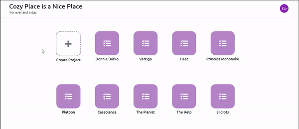

 

# Namaskar

Namaska is a web application designed to help members of organiztions track, manage, and collaborate their work. Teams members can create invite members to join their workspace and collaborate on projects and tasks.

[Namaskar Live Demo](https://namaskar-team.herokuapp.com/#)

## Features 

- Secure User authentication using BCrypt.
- Projects and tasks are separated by workspaces. User can create and delete their own workspaces.
- Users can create, view, edit, delete all tasks and projects of the workspace they are a part of. 

### Dynamic navigation

### Edit Workspace Info In-Place

### Task Check-off Animation

## Technologies
### SQL Database
- PostgreSQL
### Backend
- Ruby on Rails
### Frontend
- Javascript
- React.js
- HTML
- CSS

# Future Features
- Adding mailer function to invite user to join through email
- Dark theme
- More comprehensive tasks functionality

---
### Feel free to send me an <a href="mailto:yuehan.huang@protonmail.com">message</a>!
